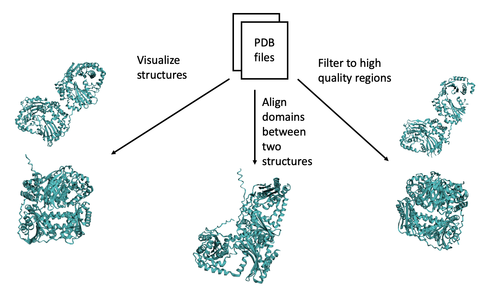

```{r, include = FALSE}
knitr::opts_chunk$set(
  collapse = TRUE,
  comment = "#>",
  fig.path = "man/figures/README-",
  out.width = "100%"
)
```

# PDBCleanup

## Description

PDBCleanup is an R package which offers utilities for improving the quality of PDB protein structure files by selecting high resolution regions and improving relative domain positions by superimposing individual regions against corresponding regions of another reference protein structure. It further allows visualization of a quality score along an input protein's sequence, visualization of the 3D protein structure produced after selecting high quality regions and performing superimposition, and visualization of the structural difference between a pair of protein structures.

This package is beneficial as a pre-processing step before performing analysis using protein structural data. It is compatible with other common structural biology packages but provides new highly customizable functions to streamline the first steps of structural data preparation.

PDBCleanup was designed with AlphaFold predicted protein structures in mind, which often contain poorly predicted regions (indicated by low pLLDT scores in the B-factor column) or misaligned domains. However, it can be used for any protein structures, including experimental protein structures.

PDBCleanup was developed in an environment using `R version 4.3.1` on an `aarch64-apple-darwin20 (64-bit)` platform running `macOS Sonoma 14.0`.

## Installation

You can install the development version of PDBCleanup from [GitHub](https://github.com/) with:

``` r
# install.packages("devtools")
library("devtools")
devtools::install_github("isaiahah/PDBCleanup", build_vignettes = TRUE)
library("PDBCleanup")
```

To run the Shiny app:
``` r
runShiny()
```

## Overview

```         
ls("package:PDBCleanup")
data(package = "PDBCleanup")  # No R datasets are available with the package
browseVignettes("PDBCleanup")
```

There are 6 functions in `PDBCleanup`:

1. `selectResno`: A small function to select a provided set of residues from a PDB protein structure.

2. `selectHighResolution`: A function to select high resolution regions in a protein structure. High resolution regions are selected using the values in the B-factor column: for experimental structures, this is B-factor which corresponds to uncertainty in position; for AlphaFold predicted structures, this is pLDDT which corresponds loosly to prediction confidence. The user provides a structure loaded using `bio3d` and whether the structure is an AlphaFold predicted structure or an experimental structure. They can optionally provide a threshold value, otherwise the function uses a default threshold. The function returns a structure compatible with `bio3d` functions for later analysis.

3. `selectOrdered`: A function to select the intrinsically ordered regions in a protein structure and remove intrinsically disordered regions. Order is predicted using the FoldIndex score. The user provides a structure loaded using `bio3d` and optionally provides a window size used to compute FoldIndex score and a threshold used to define ordered regions. The function returns a structure compatible with `bio3d` functions for later analysis.

4.  `plotProteinQuality`: A function to visualize the B-factor of a `bio3d` protein structure as a bar plot along the sequence. The user specifies whether the structure is predicted or experimental to specify the y-axis label and gives a custom plot title.

5.  `alignDomains`: A function to align a mobile protein structure against a fixed template protein structure by independently aligning each pair of provided domains. The locations of atoms in the mobile protein structure which are not part of a domain do not move. It both accepts and returns protein structures compatible with `bio3d` functions.

6.  `viewStructure`: A function to visualize the provided structure with a 3D cartoon model. This function opens a browser window with the interactive 3D protein model.

The package provides two data files containing protein structures for _E. coli_ protein Pqql, a probable zinc protease with Uniprot ID P31828. These are available for vignettes and represent a case of two very different structures for the same protein, where preprocessing may be needed.

1. `6ofs_experimental.pdb` contains an experimental structure uploaded to the PDB under ID 6ofs as part of the publication "Protase-associated import systems are widespread in Gram-negative bacteria" by Grinter R et al (2019). This file has been modified to remove HETATM and ANISOU lines from the file to reduce size.

2. `6ofs_predicted.pdb` contains a computationally predicted structure by AlphaFold2 uploaded to the AlphaFold database.

Below is a flowchart describing data preparation possible with this package.



See `help(package = "PDBCleanup")` for further details and references provided by `citation("PDBCleanup")`.

## Contributions

This package was created by Isaiah Hazelwood. The `selectResno`, `selectHighResolution`, and `selectOrdered` functions use the `atom.select` and `trim` functions from `bio3d`. The `alignDomains` function uses these `bio3d` alongside `fit.xyz` to perform domain alignments. The `selectOrdered` function uses the `foldIndexR` function from `idpr`. The `plotProteinQuality` function uses `ggplot2` to create plots. The `viewStructure` function uses `r3dmol` to create and visualize a 3D model of the protein structure. The author wrote all package functions referencing only documentation and [Anjali Silva's testing package](https://github.com/anjalisilva/TestingPackage/tree/master). No generative AI tools were used in the development of this package.


## Acknowledgements

This package was developed as part of an assessment for 2023 BCB410H: Applied Bioinformatics course at the University of Toronto, Toronto, Canada. PDBCleanup welcomes issues, enhancement requests, and other contributions. To submit an issue, use the GitHub issues.

## References

Chang W, Cheng J, Allaire J, Sievert C, Schloerke B, Xie Y, Allen J, McPherson J, Dipert A, Borges B (2023). _shiny: Web Application Framework for R_. R package version 1.8.0, <https://CRAN.R-project.org/package=shiny>.

Grant, B.J. et al. (2006) _Bioinformatics_ 22, 2695--2696.

Grinter R, Leung PM, Wijeyewickrema LC, Littler D, Beckham S, Pike RN, et al. (2019) Protease-associated import systems are widespread in Gram-negative bacteria. _PLoS Genet_ 15(10): e1008435. <https://doi.org/10.1371/journal.pgen.1008435>

H. Wickham. ggplot2: Elegant Graphics for Data Analysis. Springer-Verlag New York, 2016.

Jumper, J., Evans, R., Pritzel, A. et al. Highly accurate protein structure prediction with AlphaFold. _Nature_ 596, 583--589 (2021). <https://doi.org/10.1038/s41586-021-03819-2>

McFadden, W. M., and Yanowitz, J. L. (2022). idpr: A package for profiling and analyzing Intrinsically Disordered Proteins in R. _PLOS ONE_, 17(4), e0266929. doi:10.1371/journal.pone.0266929.

Prilusky, J., Felder, C. E., et al. (2005). FoldIndex: a simple tool to predict whether a given protein sequence is intrinsically unfolded. _Bioinformatics_, 21(16), 3435-3438.

Su W, Johnston B (2021). r3dmol: Create Interactive 3D Visualizations of Molecular Data. R package version 0.1.2, <https://CRAN.R-project.org/package=r3dmol>.

Varadi M., Anyango S., Deshpande M., et al. AlphaFold Protein Structure Database: massively expanding the structural coverage of protein-sequence space with high-accuracy models. _Nucleic Acids Research_, Volume 50, Issue D1, 7 January 2022, Pages D439–D444. <https://doi.org/10.1093/nar/gkab1061>

Zhoutong Sun, Qian Liu, Ge Qu, Yan Feng, and Manfred T. Reetz. Utility of B-Factors in Protein Science: Interpreting Rigidity, Flexibility, and Internal Motion and Engineering Thermostability. _Chemical Reviews_ 2019 119 (3), 1626-1665. <https://doi.org/10.1021/acs.chemrev.8b00290>
